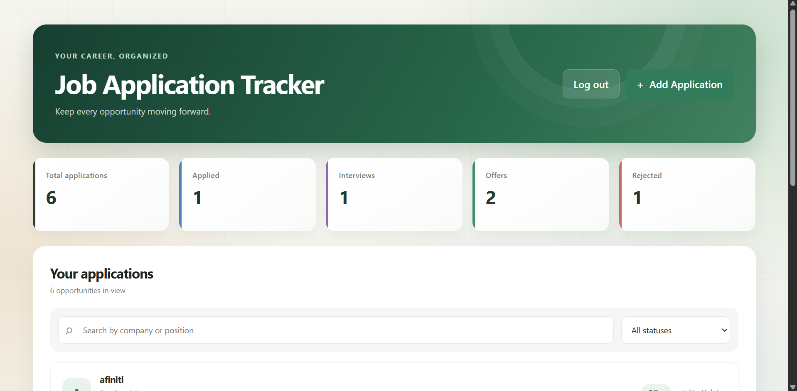
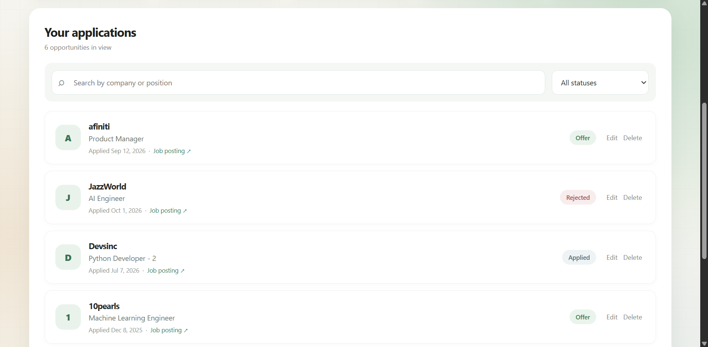
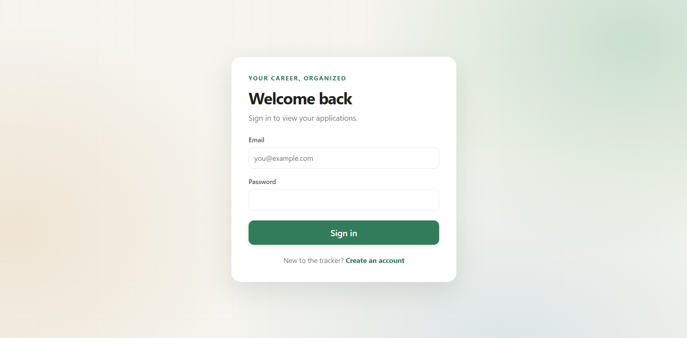
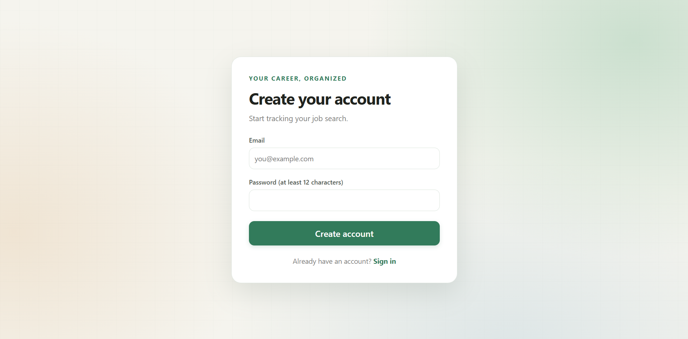
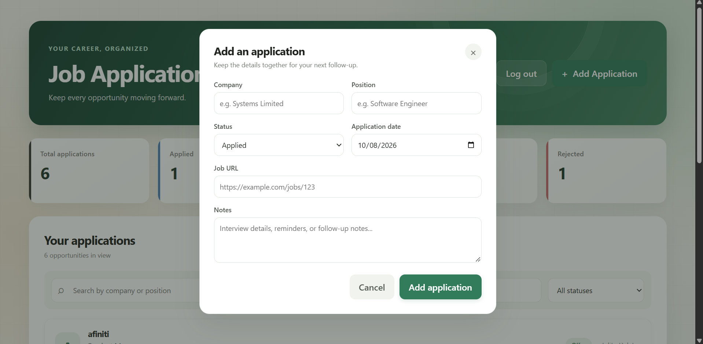

# Job Application Tracker

A personal job search dashboard for keeping track of applications, interview progress, and outcomes. The React frontend talks to a FastAPI REST API, which stores accounts and applications in PostgreSQL.

## Tech stack

- **Frontend:** React, TypeScript, Vite, and plain CSS
- **Backend:** Python, FastAPI, and Pydantic
- **Database:** PostgreSQL with SQLAlchemy 2.x
- **Migrations:** Alembic
- **Authentication:** JWT bearer tokens and Argon2 password hashing
- **Tests:** pytest and FastAPI TestClient
- **Containers:** Docker and Docker Compose

## Architecture

```text
Browser
  React + TypeScript (Vite)
       | HTTP requests with a JWT bearer token
       v
  FastAPI routers and authentication
       | SQLAlchemy sessions
       v
  PostgreSQL
```

The API owns the application data. Each application belongs to the authenticated user, and users can access only their own applications. Alembic migrations create and update the database schema.

## Features

- Register, log in, and log out
- Create, view, edit, and delete job applications
- Search by company or position and filter by status
- Dashboard counts for total applications, applied, interviews, offers, and rejections
- Track company, position, status, application date, job posting URL, and notes
- Status options: `Applied`, `Interview`, `Rejected`, `Offer`, and `Withdrawn`
- User-specific application access enforced by the API

## Run locally on Windows

### Prerequisites

- Python 3.13
- Node.js 20.19+ or 22.12+
- PostgreSQL running locally

### 1. Create the database and configure the backend

Create an empty PostgreSQL database named `job_tracker` using pgAdmin or your preferred PostgreSQL tool.

In PowerShell from the project root, copy the backend environment template:

```powershell
Copy-Item backend/.env.example backend/.env
```

Edit `backend/.env` and set `DATABASE_URL` to your local PostgreSQL username and password. Replace `JWT_SECRET_KEY` with a random value of at least 32 characters. Keep `.env` files private; they are ignored by Git.

### 2. Install backend dependencies and migrate the database

```powershell
cd backend
py -3.13 -m venv .venv
.\.venv\Scripts\Activate.ps1
python -m pip install -r requirements.txt
alembic upgrade head
python -m uvicorn app.main:app --reload
```

The API runs at <http://127.0.0.1:8000>. Interactive API documentation is at <http://127.0.0.1:8000/docs>.

### 3. Install and run the frontend

Open a second PowerShell terminal in the project root:

```powershell
cd frontend
npm ci
$env:VITE_API_BASE_URL = "http://127.0.0.1:8000"
npm run dev
```

Open the Vite URL shown in the terminal, usually <http://localhost:5173>.

### 4. Run backend tests

In a PowerShell terminal from the project root:

```powershell
cd backend
.\.venv\Scripts\Activate.ps1
python -m pytest -q
```

The tests use an isolated in-memory SQLite database and do not modify the local PostgreSQL database.

## Run with Docker Compose

Docker Desktop must be running on Windows. The app images are Linux-based, so Docker Desktop should use its Linux container engine. This is a normal Windows Docker setup; you can run these commands from PowerShell without opening a Linux terminal.

From the project root, create the local Compose environment file and start the stack:

```powershell
Copy-Item .env.example .env
docker compose up --build -d
```

Open <http://localhost:5173>. The API is available at <http://localhost:8000> and its documentation at <http://localhost:8000/docs>.

Compose starts three containers:

- `frontend` serves the built React app on port 5173. The browser uses `VITE_API_BASE_URL` to reach the API on the host.
- `backend` runs Alembic migrations and starts FastAPI on port 8000.
- `postgres` stores database files in the persistent `postgres_data` volume. FastAPI connects to it using the Compose service name `postgres`.

The Compose PostgreSQL port is 5433 on the Windows host and 5432 inside the container, which avoids conflicting with a local PostgreSQL service on port 5432. The Compose `.env.example` credentials are for local development only; replace them before using the setup anywhere shared or public.

Useful commands:

```powershell
docker compose ps
docker compose logs -f backend
docker compose exec postgres pg_isready -U job_tracker -d job_tracker
docker compose down
```

`docker compose down` preserves the database volume, so your data remains for the next start. `docker compose down -v` also deletes that volume and its database data.

## API endpoints

All request and response bodies use JSON. The application endpoints require an `Authorization: Bearer <token>` header.

| Method | Endpoint | Purpose | Authentication |
| --- | --- | --- | --- |
| `POST` | `/auth/register` | Create an account | No |
| `POST` | `/auth/login` | Log in and receive a JWT | No |
| `GET` | `/applications` | List the current user's applications | Yes |
| `GET` | `/applications/{id}` | Get one of the current user's applications | Yes |
| `POST` | `/applications` | Create an application for the current user | Yes |
| `PUT` | `/applications/{id}` | Replace an application owned by the current user | Yes |
| `DELETE` | `/applications/{id}` | Delete an application owned by the current user | Yes |

An application contains `id`, `company`, `position`, `status`, `application_date`, `job_url`, and `notes`. The server assigns `id` and the authenticated user; clients do not choose ownership.

## Screenshots

### Dashboard





### Login and registration





### Add an application



## Live demo

There is no live deployment yet. Add the public frontend URL here after deployment.
